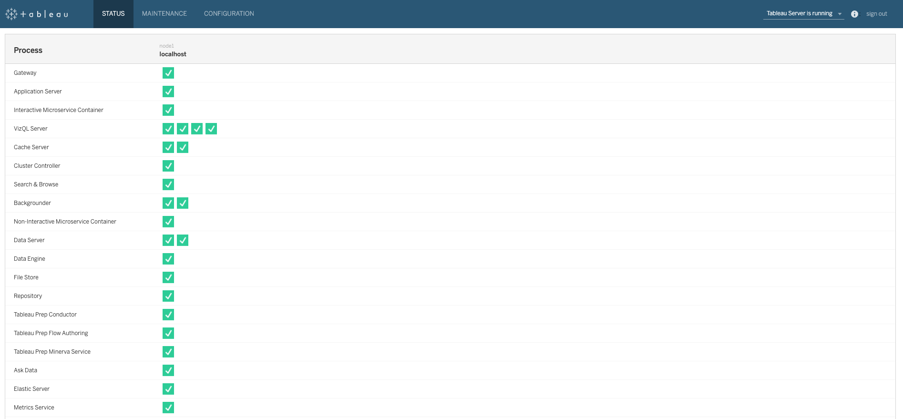
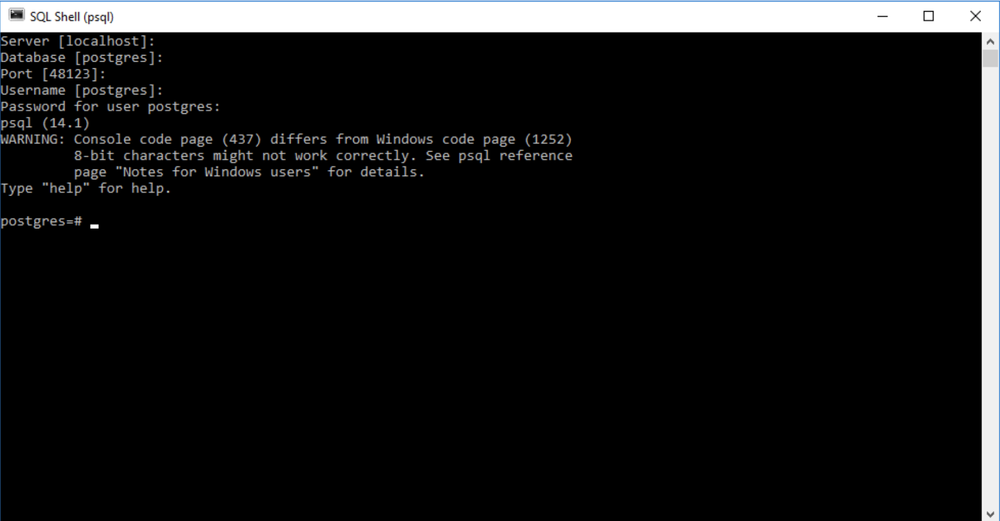
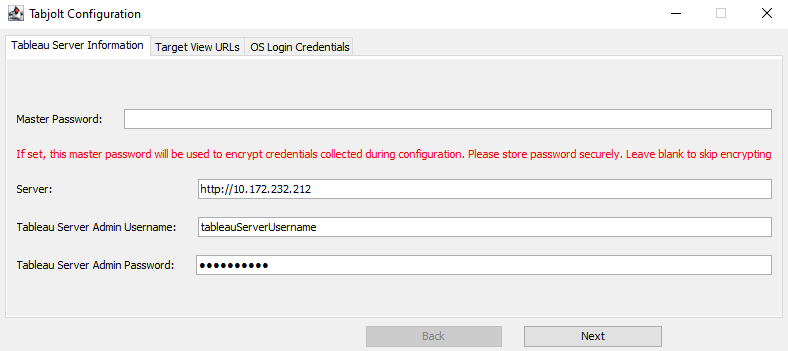
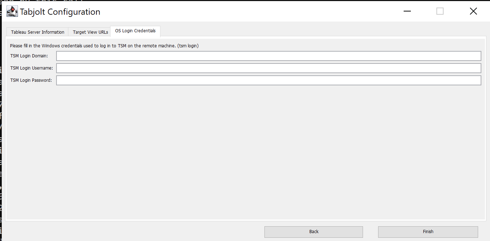
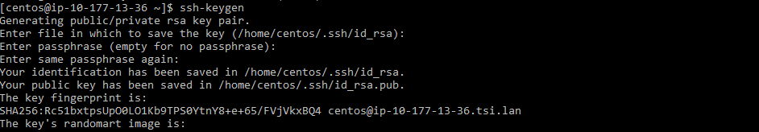

# **Latest Release**
* [Release 2022.2.3](https://github.com/tableau/tabjolt/releases/tag/v2022.2.3)
  * Please consider using the 2022.2.x release in order to ensure you are running with all available bug fixes and new features, including no log4j or Spring vulnerabilities.
  * This release includes significant documentation updates available in the `docs` folder of the package.

# **Quick Start Guide**

### Notes

  - Tabjolt only runs on Windows.
  - Tabjolt can test both Windows and Linux Tableau Servers. This guide is geared toward a Windows Tableau Server installation.<br> However, online resources can provide guidance for Linux Tableau Server specific portions of configuration and execution.<br> This guide will be updated with Linux Tableau Server testing details in the near future.


## **Step 1: Installation and setup**

### **Pre-requisites**

#### **Install Java**

- To ensure that JDK is present and installed correctly, run this command on the command prompt
<br>`java -version`
<br>The command should return the JDK version. Example:
<br>`openjdk version "11.0.11" 2021-04-20`
<br>`OpenJDK Runtime Environment Microsoft-22268 (build 11.0.11+9)`
<br>`OpenJDK 64-Bit Server VM Microsoft-22268 (build 11.0.11+9, mixed mode)`
- If you encounter an error that says `'java' is not recognized as an internal or external command`, please see the troubleshooting steps.
- Tabjolt supports only **x64** bit **openJDK version 11** or above. If needed, please download it from [here](https://openjdk.java.net/projects/jdk/17/).
&nbsp;


#### **Install PostgreSQL**

PostgreSQL must be installed for Tabjolt to be able to save its results.

- Download PostgreSQL 14 or above from [here](https://www.enterprisedb.com/downloads/postgres-postgresql-downloads). Install all the components including the `Command Line Tools`.
- While installing Postgres, ensure that:
  - Either you use the root `postgres` user or your user has the rights to create and drop DB and tables.
  - The password for the `postgres` user (or your own user) and the port number matches with what is specified in
`<Tabjolt Install Folder>\config\perftestconfig.yaml`
  <br>Example:

  | Attribute | Value |
  | ------ | ------ |
  | **DBUserName** | `postgres` |
  | **DBPassword** | `tabjoltresults` |
  | **DBServerName** | `localhost` |
  | **DBPort** | `5432` |
  | **DBName** | `perfresults` |

- To verify that PostgreSQL was installed correctly, run command `postgres -V` from the command prompt.<br>
The command should return the postgres version<br>
`postgres (PostgreSQL) 14.2`
- If it returns the following error
<br>`'postgres' is not recognized as an internal or external command, operable program or batch file.`
<br> Set the environment variable `PATH` to the `bin` folder of your postgres installation.
<br>Example:
<br>`set PATH=%PATH%;C:\Program Files\PostgreSQL\14\bin`
&nbsp;

#### **Verify Tableau Server connectivity**

- On the machine where Tabjolt is going to run, ensure that you can log in to both the Tableau server
(**Example**: `http://<myServerPortalURL>`) and the TSM UI (**Example**: `https://<myServerTSMPortalURL>:8850`)
from your browser using their respective credentials.
- Please ensure that the server under test is in a good state by assuring that the TSM UI portal homepage states -
`Tableau Server is running` - on the top right.
<br>Also ensure that all services on the page show a green check as shown below:

<kbd></kbd>

&nbsp;

#### **Configure Tableau Server**

- In order to collect JMX counters from the Tableau server, ensure that JMX is enabled on the server.
To confirm run the following on the Tableau Server machine:
<br>`tsm configuration get -k service.jmx_enabled`
- If the response to above command is `true` then JMX is enabled.
Otherwise, please follow steps provided in [this](https://help.tableau.com/current/server/en-us/ports_jmx.htm) article.
&nbsp;

### **Install Tabjolt**

- Tabjolt is available as a free download from [here](https://github.com/tableau/tabjolt/releases)
- Copy `Tabjolt_[Version].zip` to the machine that will run Tabjolt (the "`load injector`") and unzip it to the location of your choice.
We recommend Tabjolt installation directory to be `C:\TabJolt`
- The machine running Tabjolt, also referred to as the load injector, should be a different machine from Tableau Server.

&nbsp;
&nbsp;

## **Step 2: Configuration**

### **Create the Tabjolt results DB**

The Tabjolt results DB (`perfresults`) will be created in the **PostgreSQL** server by running the script
`<TabjoltInstallationFolder>\sql\CreateTabjoltResultsDatabase.sql` using the `psql` shell

- First, open the _SQL Shell (psql)_ window by clicking `”Start | PostgreSQL 14 | SQL Shell (psql)“`.
A window such as below will open up and ask for some information.
Accept all the defaults, and then type in the password for user `postgres` user when prompted.
All of the values need to match with what is contained in `<TabjoltInstallationFolder>\config\perftestconfig.yaml`.
After the password is correctly entered, you will see a screen as below -
  <kbd></kbd>

- Once the above step is completed, run the following command to create the Tabjolt DB in the PostgreSQL server.
<br>`\i 'C:\\TabJolt\\sql\\CreateTabjoltResultsDatabase.sql'` (assuming that Tabjolt installation folder is `C:\TabJolt`)

- The console output looks like below
```
psql:C:/TabJolt/sql/CreateTabjoltResultsDatabase.sql:32: NOTICE:  create database
DO
DO
DO
DO...
```

### **Configure Tabjolt**

- To configure Tabjolt, run the script `<TabjoltInstallationFolder>\ConfigureTabjolt.bat` from command prompt.
Provide values as in the examples shown below.

&nbsp;

#### **Screen 1**:

- Provide the server endpoint and credentials for your server as shown below
- Enter a `Master Password` of your choice. This will be used as a key to encrypt all other passwords.
<br>**Please note**: If you specify a master password you will need to pass it to `RunTabjolt.bat` using the `--m` flag. (see the **Run Tabjolt** step below)
- Click `Next`
<br>Example:
<br><kbd></kbd>
&nbsp;

#### **Screen 2**:

- Click `Next`
&nbsp;

#### **Screen 3**:

- Enter the credentials for the TSM
- Click `Finish`
<br>Example:
<br><kbd></kbd>
&nbsp;
&nbsp;

#### **If using a Linux server: Manually create ssh file**:

- The ssh file is needed by the Data Retriever to connect to the server machines and collect performance counters.
- It will not be created by the Configure Tabjolt steps above.
- Go to the `config` folder in your Tabjolt installation and open the `dataretriever.templ.config` file.
- Find the following line in that file:
```
        <sshSettings>
            <identity userName="centos" identityFile="sshUserIdentityFile.txt" port="22"/>
        </sshSettings>
```
- Replace `centos` with the user account you use to connect to the Linux machine hosting the Tableau Server.
- Note the identity file name `sshUserIdentityFile.txt` that will be created later.
- Connect to the Linux machine hosting the Tableau Server.
- Go to your home directory (`cd ~`) and run `ssh-keygen`.
- Do not enter a passphrase when prompted.
- This will create 2 files in the `.ssh` folder in your home folder - `id_rsa` and `id_rsa.pub`.
- The output should look something like this:
<br>Example:
<br><kbd></kbd>
&nbsp;
&nbsp;

- Copy the contents of the `id_rsa` file to the `sshUserIdentityFile.txt` file in the `config` folder in your Tabjolt installation. This was defined in the `dataretriever.templ.config` file described above.
- On the Linux machine, under the `~/.ssh` folder, there should be an `authorized_keys` file. If not, create it.
- Add the contents of the `id_rsa.pub` file created by `ssh-keygen` command above to the `authorized_keys` file. This will allow clients who have the `sshUserIdentityFile.txt` file to connect to this Linux machine.


## **Step 3: Run Tabjolt**

- Now, you can start your load test by navigating to the TabJolt installation directory (**Example**: `C:\TabJolt`),
and running the command such as the one below
<br>`RunTabjolt.bat --t=testplans\InteractVizLoadTest.jmx --m=<yourMasterPassword> --d=60 --c=1`

- If you have not used a master password while configuring Tabjolt, please skip the `--m` parameter
<br>`RunTabjolt.bat --t=testplans\InteractVizLoadTest.jmx --d=60 --c=1`

- The above example tells TabJolt to run the test for `60 seconds` (using “`--d`”) and run a single user client thread (“`--c`") and use a master password key (“`--m`"). You can change these parameters as you wish.

- Below are some of the frequently used command line parameters available for Tabjolt

  | Flag | Options/Default Value | Description |
  | ------ | ------ | ------ |
  | `--d` |  | The duration for the test. Time unit is seconds |
  | `--t` |  | Location of the Jmeter test plan |
  | `--c` |  | The number of threads to be used in the test  |
  | `--r` |  | The description of the test |
  | `--s` | Options: `true/false` <br /> Default: `false` | Whether or not to skip saving the result to DB |
  | `--m` |  | The master password if used during tabjolt configuration. Eg. `RunTabjolt.bat --t=testplans\InteractVizLoadTest.jmx --d=60 --c=1 --m=<masterPasswordYouUsed>` |
  | `--skipcounters` | Options: `true/false` <br /> Default: `false` | whether or not to skip collecting perf counters |

- Once the Tabjolt run starts, make a note of the run id that is displayed on the output as below. This will be used for filtering out the results as explained in the next section.
<br>`Perf run result is saving to result repository. Please use this RUN ID 4 to view your result in Tableau`
&nbsp;
## **Step 4: Analyze Results**

- You can check for the error count on the CMD console while the test is in progress from the `Errors:` field as shown below

```
#0      Threads: 5/5    Samples: 1      Latency: 0      Resp.Time: 2714 Errors: 0
#1      Threads: 5/5    Samples: 3      Latency: 0      Resp.Time: 2811 Errors: 0
#2      Threads: 5/5    Samples: 3      Latency: 0      Resp.Time: 1139 Errors: 0
#3      Threads: 5/5    Samples: 1      Latency: 0      Resp.Time: 1123 Errors: 0
#6      Threads: 5/5    Samples: 2      Latency: 0      Resp.Time: 3870 Errors: 0
#8      Threads: 5/5    Samples: 1      Latency: 0      Resp.Time: 5237 Errors: 0
#10     Threads: 5/5    Samples: 3      Latency: 0      Resp.Time: 6789 Errors: 0
```

 - Once the run is finished, open up the analysis workbook located at `<TabjoltInstallationFolder>\vizes\PerformanceViz.twb`
using Tableau Desktop. You may need to provide the username and password for your `postgres` user.
 - Filter by the `Test Run ID` on the top. You can select multiple test run ids to get a comparative view.
 - You can find some client-side performance metrics like Average Reponse times, throughput (average TPS) and error rates
in the dashboard `Key Perf Indicators` in the workbook.
 - The **start** and **end time** of the test can be found in the `Run Description` dashboard
 - The **CPU and Memory** on the host machines are provided in the `CPU & Memory` dashboard
 - Perf metrics for the **Vizql server** are provided in the `Vizql` dashboard
 - Similarly, perf metrics for the **application server** and **data server** can be found in the `Application Server` and `DataServer` dashboards.


# **If using Replayer**

- The Replay tool is now part of the Tabjolt installation.
- You can learn more about the Replay tool on the Tableau Community Forums [here](https://community.tableau.com/s/question/0D54T00000CWd7cSAD/replayer).
- To use the Replay tool from the UI, run `RunReplay.bat`.
- The replay tool can also be run as a test in Tabjolt. A `Replay.jmx` file is provided in the `testplans` folder. You can call
<br>`RunTabjolt.bat --t=testplans\Replay.jmx --z={replayFile:mytraffic.json}`. You will need to put the json file with traffic to replay in your Tabjolt installation folder, and specify it in the custom parameters argument.


# **Frequently Asked Questions (FAQs)**

**1.  I encountered the following error related to Java while running/configuring TabJolt:**

`Error 11000 was unexpected at this time`

**Solution**:
Please set both the environment variables `PATH` and `JAVA_HOME` prior to configuring or running TabJolt.  Sometimes, you may have multiple versions of Java running on your machine (which is fine!), hence, you may point both the environment variables to the correct Java version. Please note, TabJolt supports only **x64** bit **openJDK version 11** or above. If needed, please download it from here (https://openjdk.java.net/projects/jdk/17/).  If PATH and/or JAVA_HOME are not set properly, you may also encounter an error that says:

`'java' is not recognized as an internal or external command`

Please follow these steps to set the `PATH` and `JAVA_HOME` appropriately:

* First, you may also want to ensure that `JAVA_HOME` is set to point the location of the JDK installation directory. Run the following command to verify.
    `echo %JAVA_HOME% `
    The command should return something like: `D:\jdk-17.0.2`
* If it does not return the path to JDK directory, set `JAVA_HOME` by running a command such as in the example below:
    `set JAVA_HOME=D:\jdk-17.0.2\`
* Once `JAVA_HOME` is set, please set the `PATH` variable to point to the `\bin` folder in the JDK installation directory, as shown below
    `set PATH=%PATH%;d:\jdk-17.0.2\bin`

&nbsp;
&nbsp;

**2. I am receiving the following error while running `ConfigureTabjolt.bat`.  What is a possible cause?**
`Error: Could not find or load main class
com.tableausoftware.test.tools.TabjoltUI.tabjoltUI`
**Solution**:
`ConfigureTabjolt.bat` must load the class `TabjoltUI` class, and in the example above, the class is not on the path.  
To resolve this, on your command prompt, please navigate to the folder containing ConfigureTabjolt.bat (usually the TabJolt installation folder) and issue the command from there.

&nbsp;
&nbsp;


**3. I see no results when I run `RunTabjolt.bat` . What’s wrong?**
**Solution**:
Most likely, your `RunTabjolt.bat` script has no content/erroneous content and it may be the result of a previous copy-paste that has rendered it empty.  For example, one can pipe it by mistake if the whole of the below code is copy-pasted and executed on the console. The > will erase all content from the target (`RunTabjolt.bat` in this case)

`C:\TabJolt>RunTabjolt.bat --t=testplans\InteractVizLoadTest.jmx --d=10 --c=1`

**Example**:
```
C:\TabJolt>C:\TabJolt>RunTabjolt.bat --t=testplans\InteractVizLoadTest.jmx --d=10 --c=1
'C:\TabJolt' is not recognized as an internal or external command,
operable program or batch file.
//After this command, the RunTabjolt.bat is rendered empty!
```
&nbsp;
&nbsp;

**4. I am not able to configure TabJolt, receiving the error message : `Unable to get the top view URLs from Tableau server`.**
**Solution**:
This happens when your default site has no content. Please add some workbooks to the default site to make this work. Also, please verify that no errors were seen on the console while configuration.


**5. My TabJolt test was running fine with 0 errors and now all of a sudden, I see errors `java.net.SocketTimeoutException: Read timed out`**
**Solution**:
You may have uncovered an actual performance issue!

This error means that the server is taking longer to send the response until time-out is hit. It could be due issues on the network or server-side.

You may try running the same test by lowering down the thread count and see what happens. If it runs fine on lower thread count, then your server/server-cluster is not able to scale with the higher load.

&nbsp;
&nbsp;
